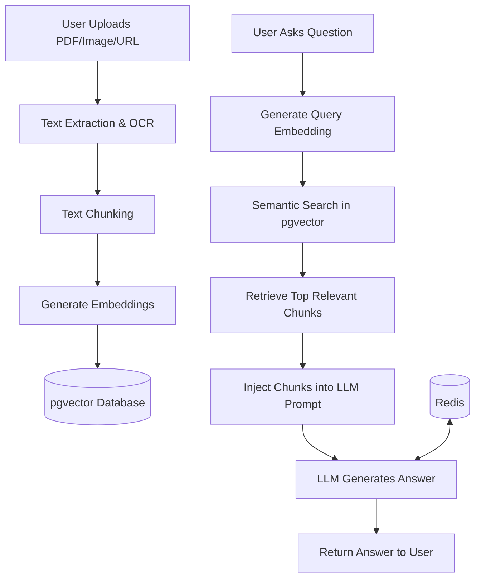

# Smart Document Search System

## Overview
An advanced, AI-powered document search and QA system that allows users to upload documents, images, and scrape URLs to build a highly searchable knowledge base. It supports semantic search, keyword search, hybrid search, and Retrieval-Augmented Generation (RAG) for answering questions intelligently based on the ingested context.

## Features
- **Document & Image Ingestion:** Upload PDF, DOCX, TXT, JPG, PNG, TIFF.
- **Web Scraping:** Ingest URLs and scrape web articles directly into the vector database.
- **Optical Character Recognition (OCR):** Automatic extraction of text from scanned PDFs and images using Tesseract.
- **AI Embeddings:** Chunks and embeds text using sentence-transformers.
- **Advanced Search:** Semantic (meaning-based), Keyword (PostgreSQL full-text), and Hybrid search.
- **Conversational AI (Chat Memory):** RAG-powered chatbot with persistent session memory (Redis) to ask follow-up questions contextually.
- **Search Analytics:** Track popular searches and query trends.

## RAG Architecture


## Setup Instructions

### 1. Requirements
- Python 3.10+
- PostgreSQL (with `pgvector` extension)
- Redis Server
- Tesseract OCR
- Ollama (for LLM inference though this project uses remote API configurations).

### 2. Tesseract OCR & Poppler Setup (Windows)
1. Download and install [Tesseract OCR](https://github.com/UB-Mannheim/tesseract/wiki).
2. Download [Poppler](https://github.com/oschwartz10612/poppler-windows/releases/) and extract it.
3. Add the `bin` directories of both Tesseract and Poppler to your system's `PATH` environment variable.


### 4. Installation
```bash
git clone https://github.com/FaizYaqoob55/smart-document-search-system.git
cd smart-document-search-system
python -m venv venv
venv\Scripts\activate
pip install -r requirements.txt
```

### 5. Environment Variables
Create a `.env` file based on `.env.example` and fill in your Supabase DB URL, Groq API key, etc.

### 6. Run the Application
```bash
uvicorn app.main:app --reload
```
API Documentation available at: `http://localhost:8000/docs`